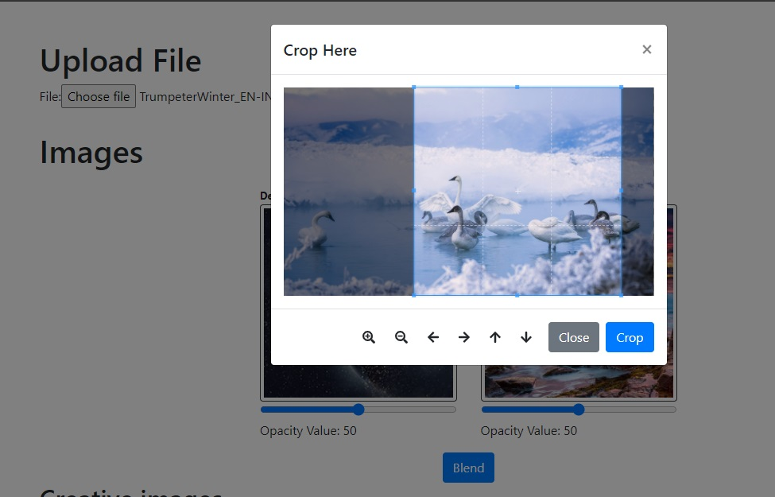
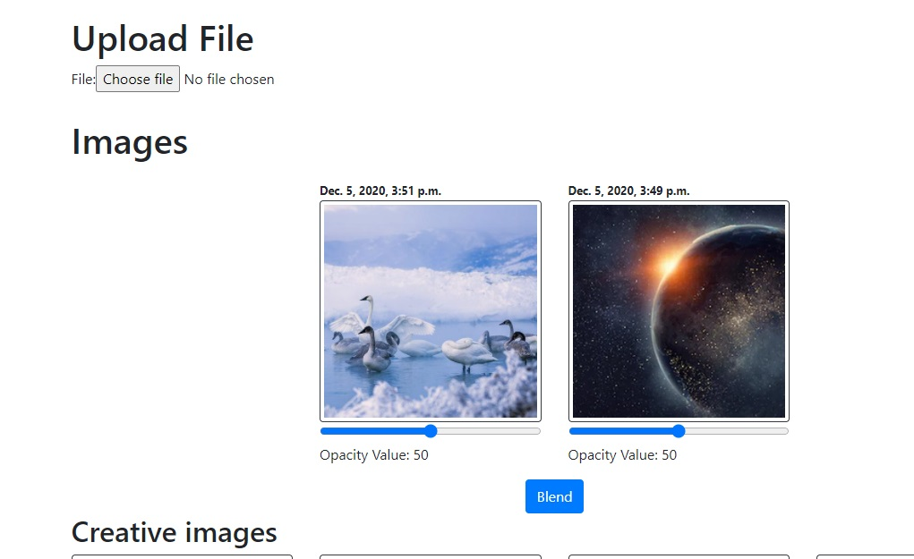

A simple photo editor app using django-3.1 and bootstrap-4
<h1>Features</h1>
  1. Image cropping 
  2. Image blending  
  3. Cartoonify image
<h1>Screenshots</h1>
<h3>Screenshot 1</h3>
 
<h3>Screenshot 2</h3>
 
<h3>Screenshot 3</h3>
 

